## AWS Embedded Transcoder Deployment Guide

### Version 1.0

### November 22, 2021

**LiveRamp**

225 Bush Street, 17th Floor

San Francisco CA 94104

Tel. (866)352-3267

Contact: [awsembeddedtranscoder@liveramp.com](mailto:awsembeddedtranscoder@liveramp.com)

**LIVERAMP MAKES NO WARRANTIES OR REPRESENTATIONS IN THIS GUIDE, EXPRESS OR IMPLIED, INCLUDING ANY WARRANTIES OF MERCHANTABILITY OR FITNESS FOR A PARTICULAR PURPOSE, OR, WITH RESPECT TO DATA, ACCURACY, COMPLETENESS, OR CURRENTNESS. THE SERVICE IS PROVIDED TO THE COMPANY STRICTLY ON AN “AS-IS, AS-AVAILABLE” BASIS, SUBJECT ONLY TO THE TERMS AND CONDITIONS CONTAINED IN THE APPLICABLE LEGAL AGREEMENT(S).**

## Overview

### Audience

This document is intended for existing LiveRamp customers with data already resolved to RampID looking for a way to translate to a partner encoded RampID within their own AWS VPC. The following sections will walk you through the deployment process starting in AWS Marketplace, downloading the CloudFormation template, and instantiating the Transcoder appliance. The audience is a data engineer tasked with transcoding.

### Prerequisites

LiveRamp’s Embedded Transcoder offering is available through the AWS Marketplace and deployed through a [CloudFormation](https://aws.amazon.com/cloudformation/) template that is stored in a GitHub repository. 

The following prerequisites are needed:

1. Access to a public GitHub repository.
2. An AWS Marketplace account and ability to procure through the Marketplace.
3. Access to [CloudFormation](https://aws.amazon.com/cloudformation/) and the ability to create [IAM](https://aws.amazon.com/iam/) roles and resources.
4. Customer data already resolved to RampID, this service will transcode from one RampID encoding to another.
5. Multi-party consent is required, both parties need to execute a LiveRamp permission order for access to be permitted to transcode to a partner RampID encoding. 

### Product Support

Support for Embedded Transcoder can be found on the following:  [developer site](https://developers.liveramp.com/retrieval-api/reference#transcode-rampids-1), [community support site ](https://support.liveramp.com/)and by working with your LiveRamp account team.  LiveRamp’s Embedded Transcoder deployment is supported by our Global Support team, a 24/7 operation to provide the first line of defense on technical issues.  Support for this product will be limited to interactions between the proxy and our encoding technology (including incoming requests) and from the proxy out to our core services (authorization requests and updates).  Other support issues involving AWS technology will need to be directed to the AWS support team.

## Executive Summary

LiveRamp’s Embedded Transcoder allows for the conversion of RampID from one encoding to RampID in another partner encoding.  This conversion takes place inside an AWS Virtual Private Cloud (VPC) so that the data never leaves your control, with attendant latency and security benefits. Transcoding requires the agreement of both parties, owners of each domain.

LiveRamp’s AWS Embedded Transcoder deployment invokes [SageMaker’s network isolation mode](https://aws.amazon.com/blogs/security/secure-deployment-of-amazon-sagemaker-resources/) on the appliance, protecting your VPC and deployed LiveRamp technology. The system design forces all interactions between the encryption technology and your VPC through a proxy service.  This proxy also handles authentication requirements and updates to the appliance.

This deployment guide details how to initialize the appliance using a CloudFormation template, walks you through authentication, and describes how to call the transcoding service. The document walks through additional details on the architecture and design, and provides additional resources for review.

The steps for deploying LiveRamp’s Embedded Transcoder are:

1. Subscribe to LiveRamp’s Embedded Transcoder product through the AWS Marketplace.
2. Execute multi-party agreements through LiveRamp for data exchange.
3. Download the template from the [public Github repository](https://github.com/LiveRamp/liveramp-aws-transcoding-public).
4. Run the template in AWS CloudFormation
5. Run the LiveRamp /init endpoint to initialize the transcoder.
6. Get a Smart Token from SM Proxy’s /request endpoint. Tokens must be refreshed every 15 minutes by calling the /request endpoint and passing the rpc parameter the value refresh.

	The system must also be reinitialized every day after 6 AM CST (UTC -6:00).

7. Use the SageMaker proxy /request endpoint to execute the transcoding; client_id, client_secret, and the rpc parameter set to request as parameters of the call.

A typical use case for Transcoding is the ability to unlock collaboration use cases by translating an encoded RampID to a partner’s encoding (or vice versa).  By leveraging LiveRamp’s Embedded Transcoder offering, you’re able to translate across identity spaces to drive actionable insights.

The Embedded Transcoder allows you to connect your LiveRamp identities with external datasets to solve problems of interest. Brands and platforms want to connect, control, and activate data quickly and securely across the advertising technology marketplace but are faced with security concerns and latency issues making it difficult to connect and take action on customer data.

## Architecture

The LiveRamp Embedded Transcoder is deployed by running a CloudFormation template in AWS using the /init endpoint, as shown in Figure 1 below. This template stands up two Virtual Private Clouds, one for the customer and a second for LiveRamp’s ID-API authentication. To obtain the needed credentials in the form of a Java Web Token (JWT) a call is made to the /auth endpoint. The session token is valid for 15 minutes from issuance. The third service call is to the /request endpoint, which passes the token and specifies the data to be processed.

>>>>>  gd2md-html alert: inline image link here (to images/image1.png). Store image on your image server and adjust path/filename/extension if necessary.  (<a href="#">Back to top</a>)(<a href="#gdcalert2">Next alert</a>) >>>>> 

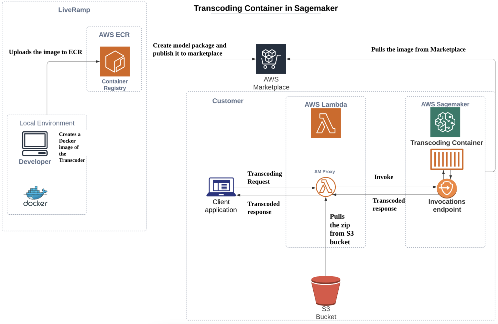

**Figure 1**. _AWS Transcoder system diagram._

Figure 2 below shows the steps involved in authentication and initialization of the transcoding process from a client/server perspective. The first step deploys the template in CloudFormation to create the system shown above. To initialize the system a service call is made to the /init endpoint. The next step is to authenticate the client by placing a service call to the /auth endpoint, which returns a JWT token. A request for transcoding is made to the /request endpoint passing the JWT, setting the RPC parameter to request, and specifying the Ramp IDs to be transcoded into the new domain.

    **NOTE**: _ In Figures 2-4 the sequence of events goes from the top to the bottom_.

>>>>>  gd2md-html alert: inline image link here (to images/image2.png). Store image on your image server and adjust path/filename/extension if necessary.  (<a href="#">Back to top</a>)(<a href="#gdcalert3">Next alert</a>) >>>>> 

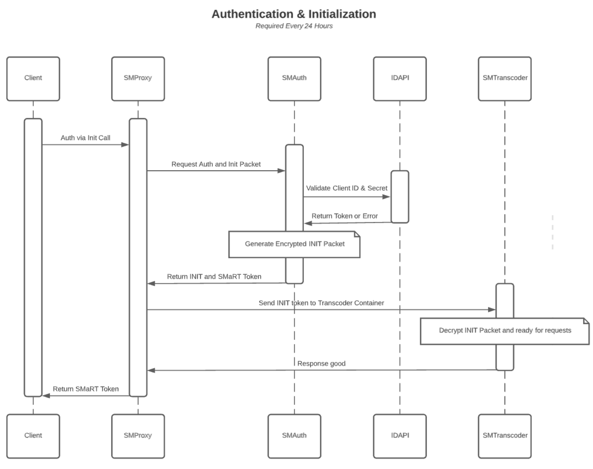

**Figure 2**. _Authentication and initialization of the transcoding process_.

In Figure 3 below the actual request, the process is illustrated. Authentication, initialization, and transcoding operations are performed as long as the system is initialized less than 24 hours before the request. The session token expires after 15 minutes, after which a refresh request for a new token must be issued.

>>>>>  gd2md-html alert: inline image link here (to images/image3.png). Store image on your image server and adjust path/filename/extension if necessary.  (<a href="#">Back to top</a>)(<a href="#gdcalert4">Next alert</a>) >>>>> 

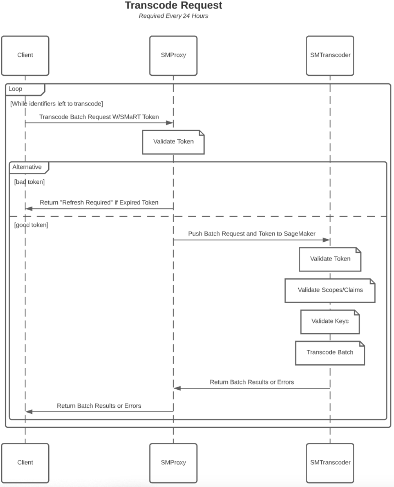

**Figure 3**. _A schematic of the transcode request process_.

Figure 4 below shows the schematic for a refresh request.

>>>>>  gd2md-html alert: inline image link here (to images/image4.png). Store image on your image server and adjust path/filename/extension if necessary.  (<a href="#">Back to top</a>)(<a href="#gdcalert5">Next alert</a>) >>>>> 

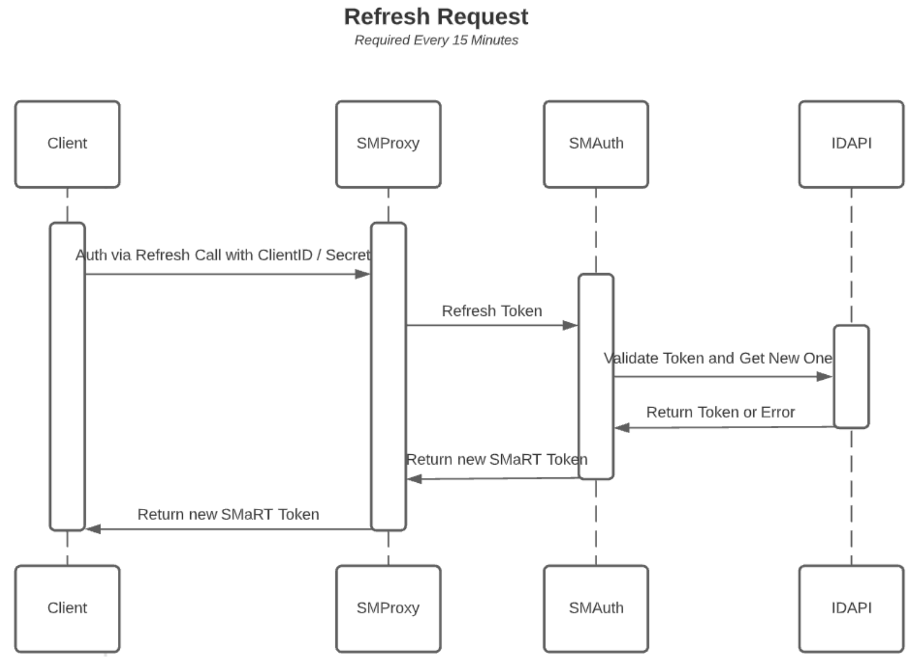

**Figure 4**. _The transcode refresh request process_.

## CloudFormation

The LiveRamp Embedded Transcoder is deployed by running a template in the form of a YAML file within AWS CloudFormation. The file is contained inside a ZIP archive obtainable from a public GitHub repository. The template installs a proxy service written as an AWS Lambda function, and a SageMaker instance inside a Virtual Private Cloud. The VPC settings place the Transcoder deployment into network isolation mode, which only allows incoming requests through the proxy server to be processed.

To deploy the AWS Embedded Transcoder, do the following:

1. Go to the Github repository located [here](https://github.com/LiveRamp/liveramp-aws-transcoding-public).
2. Download the CloudFormation_Template_XXX_Transcodes.YAML template desired to the storage system of your choice.

    Storage targets include either cloud or local storage.

    **NOTE**: _Select _XXX=10k_ for up to 10,000 transcoding operations per second, _XXX=100K_ for up to 100,000 transcoding operations per second, or _XXX=1Million_ for one million (1,000,000) transcoding operations per second._ 

3. Log into an AWS CloudFormation account that allows the user to create stacks from project templates and click on Stacks in the navigation pane as shown in Figure 5 below.

>>>>>  gd2md-html alert: inline image link here (to images/image5.png). Store image on your image server and adjust path/filename/extension if necessary.  (<a href="#">Back to top</a>)(<a href="#gdcalert6">Next alert</a>) >>>>> 

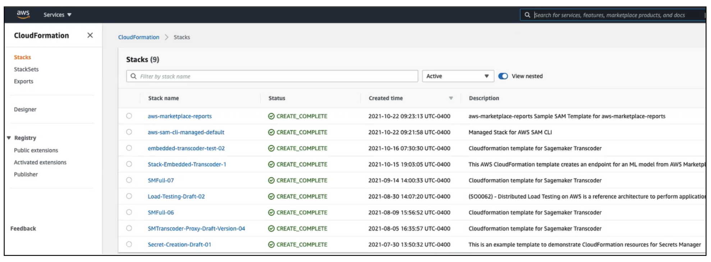

**Figure 5**. _Open the CloudFormation Stacks section to use the deployment template_.

4. Click on the Stack Actions drop-down menu at the top right of the Stacks section and select the create stack With new resources selection.
5. On the Create Stack page shown in Figure 6 below select the Template source (Amazon S3 URL or Upload a template file), click the Choose file button, select your template file, and then click the Next button.

>>>>>  gd2md-html alert: inline image link here (to images/image6.png). Store image on your image server and adjust path/filename/extension if necessary.  (<a href="#">Back to top</a>)(<a href="#gdcalert7">Next alert</a>) >>>>> 

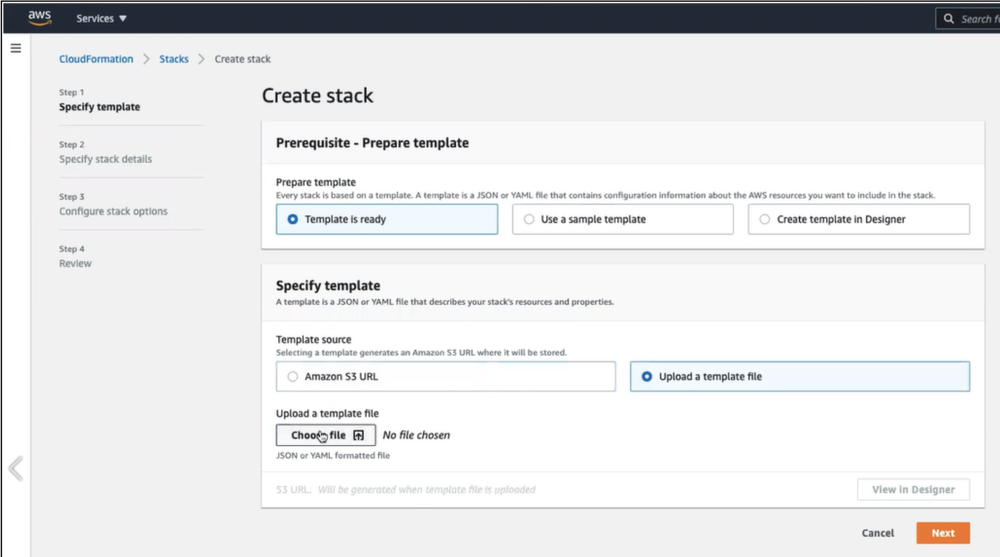

**Figure 6**. _The CloudFormation Create stack page_.

6. On the Specify stack details page, shown in Figure 7 below, enter the name of your new transcoder deployment, then click the Next button.

>>>>>  gd2md-html alert: inline image link here (to images/image7.png). Store image on your image server and adjust path/filename/extension if necessary.  (<a href="#">Back to top</a>)(<a href="#gdcalert8">Next alert</a>) >>>>> 

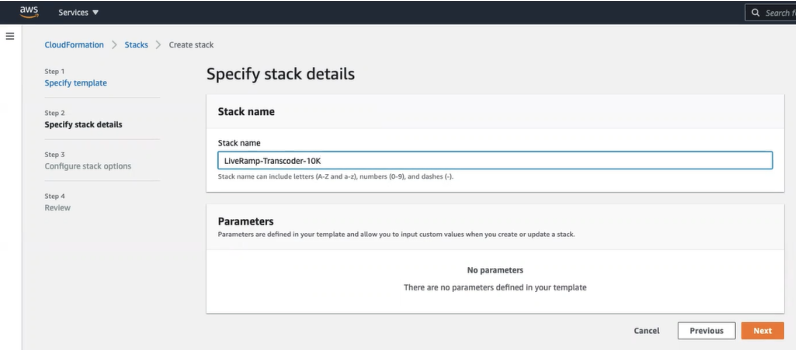

**Figure 7**. _The Specify stack details step is where you name your deployment_.

7. On the Configure stack options page (Step 3) accept the default selections and click the Next button.
8. Complete the wizard by scrolling down to the Capabilities section and enabling the **I acknowledge that AWS CloudFormation might create IAM resources **check box; then click the Create stack button as shown in Figure 8 below.

>>>>>  gd2md-html alert: inline image link here (to images/image8.png). Store image on your image server and adjust path/filename/extension if necessary.  (<a href="#">Back to top</a>)(<a href="#gdcalert9">Next alert</a>) >>>>> 

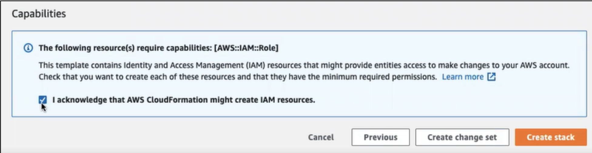

**Figure 8**._ Enable the acknowledgment and click the Create stack button to initiate the deployment._

When the wizard closes you are returned to the Stacks section and the new deployment will be listed as the latest event, along with its status as CREATE_IN_PROGRESS. The staging time is variable, depending on several factors such as datacenter used, network traffic, the template that you chose, and more. A typical deployment will take from about 7 to 15 minutes and completion changes the status of the deployment to CREATE_COMPLETE.

    **NOTE**: _All elements of the deployment must be successfully deployed or the system rolls back the resources to their previous state._

When the deployment is complete all of the resources will show a CREATE_COMPLETE status as shown in Figure 9 below. The Endpoint resource is the last resource to be completed.

>>>>>  gd2md-html alert: inline image link here (to images/image9.png). Store image on your image server and adjust path/filename/extension if necessary.  (<a href="#">Back to top</a>)(<a href="#gdcalert10">Next alert</a>) >>>>> 

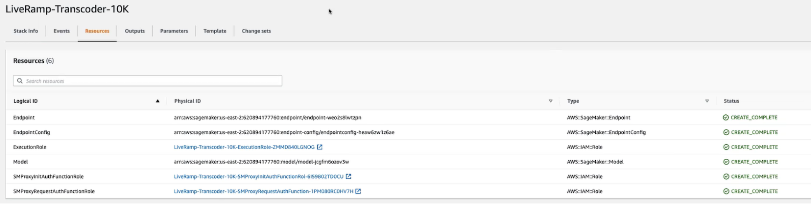

**Figure 9**. _All of the completed resources for the transcoder deployment are shown here_.

To determine the transcoder endpoints from the AWS API Gateway:

1. Log into AWS API Gateway and select the transcoder deployment from the list of the available APIs as shown in Figure 10 below.

>>>>>  gd2md-html alert: inline image link here (to images/image10.png). Store image on your image server and adjust path/filename/extension if necessary.  (<a href="#">Back to top</a>)(<a href="#gdcalert11">Next alert</a>) >>>>> 

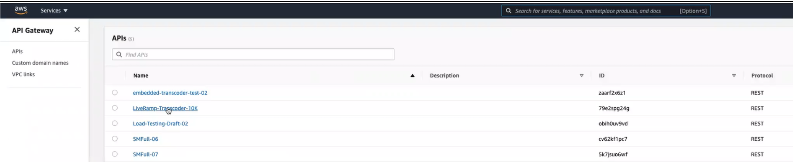

**Figure 10**. _Select the transcoder deployment in AWS API Gateway to open the endpoint’s methods._

2. On the Resources page click on the Stages link in the left hand navigation pane, as shown in Figure 11 below.

>>>>>  gd2md-html alert: inline image link here (to images/image11.png). Store image on your image server and adjust path/filename/extension if necessary.  (<a href="#">Back to top</a>)(<a href="#gdcalert12">Next alert</a>) >>>>> 

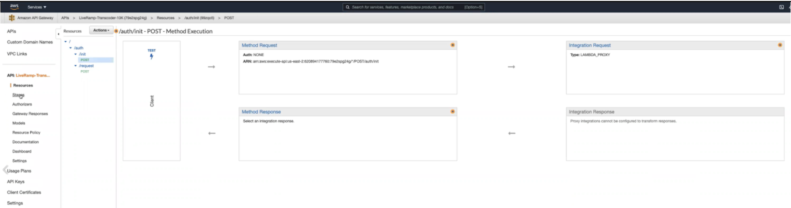

**Figure 11**. _The installed endpoints for the transcoder_.

3. Click on the Prod environment, then click on the endpoint you want to invoke as shown in Figure 12 below.

    The URL to invoke the endpoint is listed in the blue stripe at the top of the page shown boxed in red.

>>>>>  gd2md-html alert: inline image link here (to images/image12.png). Store image on your image server and adjust path/filename/extension if necessary.  (<a href="#">Back to top</a>)(<a href="#gdcalert13">Next alert</a>) >>>>> 

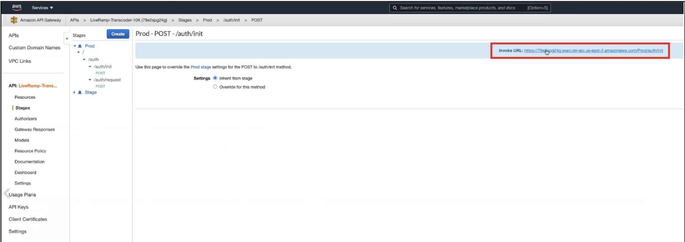

**Figure 12**. _The Invoke URL endpoint appears in the Stages section for each method_.

    **CAUTION**: _The creation of a stack deploys AWS resources that generate charges for an organization. You should use the template that is the appropriate size, and delete stacks when the work is completed to minimize your costs._

To delete the transcoder deployment:

1. Log into the CloudFormation console with appropriate privileges to delete a stack.
2. Select the deployment stack and click on the Delete button, as shown in Figure 13 below.

>>>>>  gd2md-html alert: inline image link here (to images/image13.png). Store image on your image server and adjust path/filename/extension if necessary.  (<a href="#">Back to top</a>)(<a href="#gdcalert14">Next alert</a>) >>>>> 

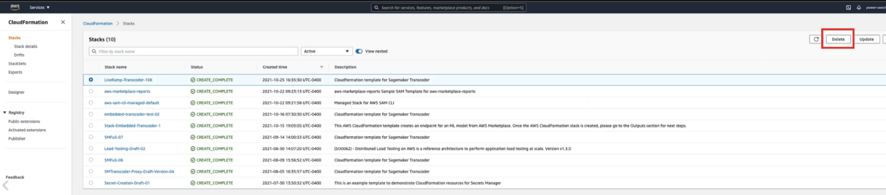

**Figure 13**. _To delete the transcoder, delete its stack in CloudFormation_.

## 

## Authentication and Initialization

The Embedded Transcoder uses SageMaker Authentication (SM Auth) to validate user requests. A user of the transcoding appliance calls the /init endpoint to activate the system by calling an AWS Lambda function within LiveRamp’s VPC. The init_token Lambda function returns the required encryption keys.

A call to the /auth endpoint calls a second auth_token Lambda function in the LiveRamp VPC, which then places a service call to the Identity API to obtain a session key in the form of a smart token that is used in the actual transcoding service request. That session key contains domain information used in the transcoding process. It is called a “Smart Token” because it contains information required by the specific transcoding process that the customer is performing.

The auth_token performs the following operations when called by SM Proxy auth service which resides in the Customer's VPC

1. Reads the input from the SM Proxy service auth request for client credentials.
2. Calls the ID-API /token endpoint with those credentials and fetches the ID-API authentication token.
3. Calls the Identity API /domains endpoint using the ID-API authentication token and fetches the domain keys needed for transcoding.
4. Creates a Scopes object that indicates the transcoding directions for the domains.
5. Wraps the ID-API token and Scopes object along with expiration time stamp, and encodes that data to generate a JWT token called a Smart Token.

A cURL request for the auth_token would take the following format:

    curl --location --request POST 'https://&lt;hostname>.execute-api.&lt;region>.amazonaws.com/Stage/token/request' \

    --header 'Content-Type: application/json' \

    --data-raw '{

        "httpMethod": "POST",

        "client_id": "&lt;insert client id here>",

        "client_secret": "&lt;insert client secret here>"

    }'

The init_token LiveRamp Lambda function performs the following operations when called by SM Proxy init service which resides in the customer's VPC:

1. Reads the input from the SM Proxy service init request for client credentials.
2. Calls ID-API /token endpoint with those credentials and fetches the ID-API authentication token.
3. Calls the /domains endpoint using the ID-API authentication token and fetches the domain keys needed for transcoding.
4. Creates a Scopes object that contains the transcoding directions for the domains.
5. Wraps the ID-API token and Scopes object along with expiration time stamp, and encodes that data to generate a JWT token called a SMART TOKEN.
6. The init_token Lambda function encrypts the domain keys, generates cipher text, a session key, and an initialization vector.
7. The init_token Lambda function encodes the data from Step 6 to generate a JWT token called the init_token.

The cURL request for the init_token is:

    curl --location --request POST 'https://&lt;hostname>.execute-api.&lt;region>.amazonaws.com/Stage/token/init' \

    --header 'Content-Type: application/json' \

    --data-raw '{

        "httpMethod": "POST",

        "client_id": "&lt;insert client id here>",

        "client_secret": "&lt;insert client secret here>"

    }'

Only the calls that are needed for initialization and refreshing the token communicate with LiveRamp’s APIs. All transcoding procedures run within the client’s VPC.

## 

## Transcoding

The SageMaker Proxy function is a Lambda routine that resides in the customer’s VPC. It has two functions: request_auth and init_auth. SageMaker Proxy accepts only incoming service requests to perform transcoding operations. The transcoding operation is performed through AWS SageMaker.

The SageMaker request_auth function receives an input request from the client through its /request endpoint with the following parameters.

1. smart_token - a Java Web Token (JWT) used for authentication.
2. transcode_data - contains the transcode data in the form of a JSON array of JSON objects to be input.
3. rpc - that parameter indicates if it is an init, request or refresh.

The request_auth function performs the following validations before performing the real transcoding operation:

1. Validates the operation only if the smart_token is present in the input request body.
2. Validates the operation contains the transcode_data in the input request body.
3. Validates that the rpc parameter is present in the input request body and the value is either request or refresh.

If any of these validations fail then the request_auth function sends an appropriate error response to the client. The common errors included:

* 400 - Bad request.
* 401 - Unauthorized.
* 405 - Method not allowed.
* 500 - Internal Server Error.

The request_auth steps performed when RPC is refresh includes the following:

1. Validate the input request body to read the client_id and the client_secret parameters.
2. Call the SM Auth Request Service and pass those credentials to receive a new smart_token.
3. Send the smart_token back to the client.

The cURL call to the request_auth Lambda function is:

    curl --location --request POST 'https://&lt;hostname>.execute-api.&lt;region>.amazonaws.com/Stage/auth/request' \

    --header 'Content-Type: application/json' \

    --data-raw '{

        "httpMethod": "POST",

        "client_id": "&lt;insert client id here>",

        "client_secret":"&lt;insert client secret here>",

        "rpc" : "refresh"

    }'

The request_auth execution steps when RPC is the request type is:

1. Reads the input request body for the smart_token and transcode_data parameters.
2. Validates the token for signature and expiry.

    If invalid or expired it returns an appropriate error response to the client.

3. If the token is valid it calls the SageMaker endpoint and passes the transcode data and Smart Token as parameters.
4. The request_auth function receives the transcoded links from SageMaker and sends the response back to the client.

The cURL call to the request_auth Lambda function is:

    curl --location --request POST https://&lt;hostname>.execute-api.&lt;region>.amazonaws.com/Stage/auth/request' \

    --header 'Content-Type: application/json' \

    --data-raw '{

        "httpMethod": "POST",

        "transcode_data" : [],

        "smart_token" : "&lt;insert smart token here",

        "rpc" : "request"

    }'

The /init_auth function fetches the domain keys from the SageMaler Auth service and passes those keys to Transcoder. Domain keys are retained for 24 hours.

The /init_auth function receives an input request from the client service that typically contains the following parameters:

1. client_id - used for authentication.
2. client_secret - contains the client secret that has access to ID-API.
3. rpc - that indicates if it is an init, request, or refresh.

Then /init_auth performs the following validations before performing the real operation.

1. Validates if client_id is present in the input request body.
2. Validates if client_secret is present in the input request body.
3. Validates if RPC is present in the input request body and the value is init.

If any of these validations fail then an error is returned to the client.

The init_auth execution steps when RPC is set to init are:

1. Calls the SM Auth Init service with the client credentials.
2. Validates the token for signature and expiry.  If invalid or expired it returns an appropriate error response to the client.
3. If the token is valid it invokes the SageMaker endpoint and passes the init token to receive a response that indicates the status of Transcoding Initialization.
4. It extracts the smart token out of init token.
5. Sends the smart_token and initialization response status back to the client.

The cURL request for the init_token endpoint in a staging environment is:

    curl --location --request POST 'https://&lt;hostname>.execute-api.&lt;region>.amazonaws.com/Stage/auth/init' \

    --header 'Content-Type: application/json' \

    --data-raw '{

        "httpMethod": "POST",

        "client_id": "&lt;insert client id here>",

        "client_secret": "&lt;insert client secret here>",

        "rpc": "init"

    }'

## Metrics

There are multiple logs and metrics captured throughout the system. Some logs are stored only in the account where the appliance is deployed and if an issue arises, it is at the discretion of the AWS Account Owner on the logs and metrics to communicate to LiveRamp.  Other metrics are communicated to LiveRamp automatically, including usage metrics (number of successful transcoding calls by domain) to assist with billing and authorization metrics (token validation failed) for example.  

Other metrics may be stored in AWS Cloudwatch on the Account of the deployed appliance. If troubleshooting an issue with LiveRamp, LiveRamp may request copies/screenshots/dumps of logs and metrics in order to better assist with troubleshooting. 

Additional metrics, measuring Transcoder performance, are under active development. 

## 

## API Reference

The Embedded Transcoder has two API endpoints: /init and /request. They are documented in the following two sections.

### /init Endpoint

<table>
  <tr>
   <td><strong>Part</strong>
   </td>
   <td><strong>Purpose</strong>
   </td>
   <td><strong>Value</strong>
   </td>
  </tr>
  <tr>
   <td>Title
   </td>
   <td>Name
   </td>
   <td>init
   </td>
  </tr>
  <tr>
   <td>Path
   </td>
   <td>URL
   </td>
   <td>/Prod/auth/init
   </td>
  </tr>
  <tr>
   <td>Method
   </td>
   <td>OpType
   </td>
   <td>POST
   </td>
  </tr>
  <tr>
   <td>ShDesc
   </td>
   <td>for SEO
   </td>
   <td>Initialize SageMaker Transcoder
   </td>
  </tr>
  <tr>
   <td>Desc
   </td>
   <td>Context
   </td>
   <td>
   </td>
  </tr>
  <tr>
   <td>Parameters
   </td>
   <td>Config.
   </td>
   <td>clientID (String); client_secret (String); rpc (String, default=int)
   </td>
  </tr>
  <tr>
   <td>Request
   </td>
   <td>Input
   </td>
   <td>/prod/auth/init
   </td>
  </tr>
  <tr>
   <td>cURL
   </td>
   <td>
   </td>
   <td>curl --location --request POST 'https://&lt;hostname>.execute-api.&lt;region>.amazonaws.com/Prod/auth/init' \

--header 'Content-Type: application/json' \

--data-raw '{

"httpMethod": "POST",

"client_id": "&lt;insert client id here>",

"client_secret": "&lt;insert client secret here>",

"rpc": "init"

}'
   </td>
  </tr>
  <tr>
   <td>Response
   </td>
   <td>Output
   </td>
   <td>{

"transcoder_response": "Transcoder Initialization successful",

"smart_token": "xxxxxxxxxxxx"

}
   </td>
  </tr>
  <tr>
   <td>Status & Errors
   </td>
   <td>Output
   </td>
   <td>{

"200": "Success",

"400": "Bad Request",

"401": "Not authenticated",

"500": "Server Error"

}
   </td>
  </tr>
  <tr>
   <td>Tags
   </td>
   <td>Category
   </td>
   <td>
   </td>
  </tr>
  <tr>
   <td>Status
   </td>
   <td>Status
   </td>
   <td>Production
   </td>
  </tr>
  <tr>
   <td>Authentication Method
   </td>
   <td>AAA
   </td>
   <td>Yes. Need client credentials within the input request body to initialize Sagemaker Transcoder.
   </td>
  </tr>
  <tr>
   <td>See Also
   </td>
   <td>Relationships
   </td>
   <td>
   </td>
  </tr>
  <tr>
   <td>Version
   </td>
   <td>Status
   </td>
   <td>"1.0.0"
   </td>
  </tr>
</table>

### /request Endpoint

<table>
  <tr>
   <td><strong>Part</strong>
   </td>
   <td><strong>Purpose</strong>
   </td>
   <td><strong>Value</strong>
   </td>
  </tr>
  <tr>
   <td>ID
   </td>
   <td>ID
   </td>
   <td>
   </td>
  </tr>
  <tr>
   <td>Title
   </td>
   <td>Name
   </td>
   <td>request
   </td>
  </tr>
  <tr>
   <td>Path
   </td>
   <td>URL
   </td>
   <td>/prod/auth/request
   </td>
  </tr>
  <tr>
   <td>Method
   </td>
   <td>OpType
   </td>
   <td>POST
   </td>
  </tr>
  <tr>
   <td>ShDesc
   </td>
   <td>for SEO
   </td>
   <td>To transcode data using a smart token and to refresh that smart token
   </td>
  </tr>
  <tr>
   <td>Desc
   </td>
   <td>Context
   </td>
   <td>
   </td>
  </tr>
  <tr>
   <td>Parameters
   </td>
   <td>Config.
   </td>
   <td>To transcode data: smart_token (String); transcode_data (JSON array); rpc (String, default= request)

To refresh the smart_token: client_id (String); client_secret (String

), and rpc (String, default = refresh)
   </td>
  </tr>
  <tr>
   <td>Request
   </td>
   <td>Input
   </td>
   <td>/prod/auth/request
   </td>
  </tr>
  <tr>
   <td>cURL
   </td>
   <td>
   </td>
   <td>curl --location --request POST 'https://&lt;hostname>.execute-api.&lt;region>.amazonaws.com/Prod/auth/request' \

--header 'Content-Type: application/json' \

--data-raw '{

"httpMethod": "POST",

"client_id": "&lt;insert client id here>",

"client_secret":"&lt;insert client secret here>",

"rpc" : "refresh"

}'

curl --location --request POST 'https://&lt;hostname>.execute-api.&lt;region>.amazonaws.com/Prod/auth/request' \

--header 'Content-Type: application/json' \

--data-raw '{

"httpMethod": "POST",

"transcode_data" : [],

"smart_token" : "&lt;insert smart token here",

"rpc" : "request"

}'
   </td>
  </tr>
  <tr>
   <td>Response
   </td>
   <td>Output
   </td>
   <td>An array of transcoded links when RPC in the input request body is "request". A smart token when RPC in the input request body is "refresh".
   </td>
  </tr>
  <tr>
   <td>Status & Errors
   </td>
   <td>Output
   </td>
   <td>{

"200": "Success",

"400": "Bad Request",

"401": "Not authenticated",

"500": "Server Error"

}
   </td>
  </tr>
  <tr>
   <td>Tags
   </td>
   <td>Category
   </td>
   <td>
   </td>
  </tr>
  <tr>
   <td>Status
   </td>
   <td>Status
   </td>
   <td>Production
   </td>
  </tr>
  <tr>
   <td>Authentication Method
   </td>
   <td>AAA
   </td>
   <td>Yes. Need a smart token within the input request body to transcode the data. Need client credentials within the input request body to refresh the smart token.
   </td>
  </tr>
  <tr>
   <td>See Also
   </td>
   <td>Relationships
   </td>
   <td>
   </td>
  </tr>
  <tr>
   <td>Version
   </td>
   <td>Status
   </td>
   <td>"1.0.0"
   </td>
  </tr>
</table>

## Errors

When working with the API you may sometimes receive an error code in the response. Refer to the following table for a description of errors you may encounter.

<table>
  <tr>
   <td><strong>Code</strong>
   </td>
   <td><strong>Description</strong>
   </td>
  </tr>
  <tr>
   <td>E000
   </td>
   <td>Failed Transcoding for Unknown Reason...
   </td>
  </tr>
  <tr>
   <td>E002
   </td>
   <td>Unable to process transcode due to a security exception. Most likely a bad key or unauthorized transcode.
   </td>
  </tr>
  <tr>
   <td>E003
   </td>
   <td>Invalid argument size for batch transcoding
   </td>
  </tr>
  <tr>
   <td>E004
   </td>
   <td>Unsupported Transcoding Type for now 'Other to Native
   </td>
  </tr>
  <tr>
   <td>E005
   </td>
   <td>Unable to parse and validate SMaRT Token
   </td>
  </tr>
  <tr>
   <td>E006
   </td>
   <td>Unable to parse request body
   </td>
  </tr>
  <tr>
   <td>E007
   </td>
   <td>Invalid Transcoding type
   </td>
  </tr>
  <tr>
   <td>E008
   </td>
   <td>Transcode type not yet supported
   </td>
  </tr>
  <tr>
   <td>I000
   </td>
   <td>Unable to create RampID for a partner. Invalid Link Operation
   </td>
  </tr>
  <tr>
   <td>I001
   </td>
   <td>Error Decoding RampID
   </td>
  </tr>
  <tr>
   <td>I002
   </td>
   <td>Error Encoding RampID
   </td>
  </tr>
  <tr>
   <td>S001
   </td>
   <td>Not authorized for this procedure or invalid token
   </td>
  </tr>
  <tr>
   <td>S002
   </td>
   <td>Unable to create private key
   </td>
  </tr>
  <tr>
   <td>S003
   </td>
   <td>Unable to create public key
   </td>
  </tr>
  <tr>
   <td>S004
   </td>
   <td>Unable to decrypt via Private/Public Algorithm
   </td>
  </tr>
  <tr>
   <td>S005
   </td>
   <td>Unable to decrypt via Bulk Algorithm
   </td>
  </tr>
  <tr>
   <td>S006
   </td>
   <td>Unable to decrypt and load key packet
   </td>
  </tr>
  <tr>
   <td>S007
   </td>
   <td>Invalid or missing key for domain sent (value)
   </td>
  </tr>
  <tr>
   <td>S008
   </td>
   <td>Invalid or missing key for domain sent (target)
   </td>
  </tr>
  <tr>
   <td>S009
   </td>
   <td>Not Authorized to go from domain (value)
   </td>
  </tr>
  <tr>
   <td>S010
   </td>
   <td>Not Authorized to go to domain (target)
   </td>
  </tr>
  <tr>
   <td>S011
   </td>
   <td>Not able to validate access
   </td>
  </tr>
  <tr>
   <td>S012
   </td>
   <td>Not able to validate token
   </td>
  </tr>
</table>

## See Also

[AWS Network isolation](https://docs.aws.amazon.com/AWSEC2/latest/WindowsGuide/infrastructure-security.html)

[AWS SageMaker documentation](https://docs.aws.amazon.com/sagemaker/)

[Embedded Transcoder GitHub repository](https://github.com/LiveRamp/liveramp-aws-transcoding-public)

[LiveRamp's API Developer Hub](https://liveramp.com/developers/product/identity/)

